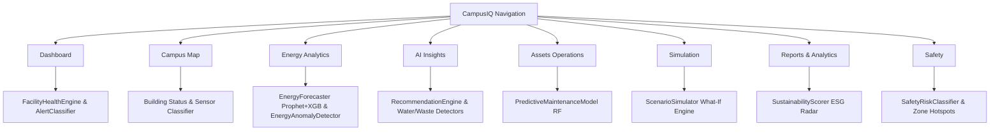

# 🧠 CampusIQ — AI/ML Facility Intelligence Engine

CampusIQ is an **AI-powered Decision Support & Facility Intelligence System** designed for large institutions across India (Colleges, Hospitals, Industrial Estates, Municipal Campuses). It ingests multi-sensor data, detects operational anomalies, forecasts trends, evaluates what-if simulations, and delivers explainable plain-language recommendations.

---

## 📌 Problem Statement Alignment
- **Problem:** Fragmented data across energy, water, waste, air quality, assets, and safety creates operational blindspots.
- **Solution:** Multi-sector intelligence pipeline converting **Data → Analysis → Problem Detection → Prediction → Recommendation → Decision**.
- **Sectors Supported:**
  1. 🎓 **Engineering College** (Academic Block, Hostels, Admin, Canteen, Sports Complex)
  2. 🏥 **District Hospital** (OPD, IPD, Emergency, Pharmacy, Staff Quarters)
  3. 🏭 **Industrial Estate** (Manufacturing Plants A/B, Warehouse, ETP Utility, Workshops)
  4. 🏛️ **Municipal Corporation Campus** (Main Office, Public Hall, Records, Water Works)

---

## 🛠️ Technology Stack & Libraries

| Category | Technologies / Libraries | Purpose |
|---|---|---|
| **Core Language** | Python 3.11+ | Modeling, data pipelines, API backend |
| **Data Engineering** | `pandas`, `numpy`, `scipy` | Time-series data cleaning, rolling statistical features, z-scores |
| **Forecasting** | `prophet`, `xgboost` | Hybrid additive decomposition + gradient boosted residual learning |
| **Anomaly Detection** | `scikit-learn` (Isolation Forest) | Multi-variate unsupervised anomaly scoring and outlier identification |
| **Predictive Maintenance** | `scikit-learn` (Random Forest Classifier & Regressor) | Remaining Useful Life (RUL) estimation & failure risk classification |
| **Classification & NLP** | `xgboost`, Rule Engine, Template Synthesizer | Safety incident risk, waste overflow, plain-language insights & ROI estimation |
| **API Framework** | `fastapi`, `uvicorn`, `pydantic` | High-performance asynchronous REST API serving all navigation views |
| **Model Serialization** | `joblib` | Production model artifact storage and fast warm-start loading |
| **Continuous Learning** | Custom Active Anomaly Feedback Engine | Imbalanced anomaly logging, drift monitoring & precision/recall optimization |

---

## 📊 Navigation Pages → ML Model Mapping



### Model Specifications

| # | Model Name | Algorithm | Input Features | Key Output | Target Navigation View |
|---|---|---|---|---|---|
| 1 | **Facility Health Scorer** | Weighted Composite Multi-Criteria | Domain anomaly ratios, critical asset counts, AQI | 0-100% composite health & domain sub-scores | 📊 Dashboard, 🗺️ Campus Map |
| 2 | **Energy Forecaster** | Hybrid Prophet + XGBoost | Timestamp, lag-features, day-of-week, weather (temp/humidity) | 7-day hourly kWh forecast & confidence intervals | ⚡ Energy Analytics, 📊 Dashboard |
| 3 | **Energy Anomaly Detector** | Isolation Forest + Rolling Z-Score | kWh, 6h rolling mean/std, peak hour flag, temperature delta | Spike/drop flags, anomaly score (0-1), severity level | ⚡ Energy Analytics, 🤖 AI Insights |
| 4 | **Water Anomaly Detector** | Isolation Forest + Night Flow Ratio | Litres, night flow (1-4 AM ratio), 6h rolling variance | Burst pipe vs continuous leak detection | 🤖 AI Insights, 📊 Dashboard |
| 5 | **Waste Overflow Predictor** | XGBoost Regressor & Classifier | Fill level %, bin capacity, fill rate estimate, time | Hours to overflow, priority collection route | 🤖 AI Insights, 🗺️ Campus Map |
| 6 | **AQI Forecaster** | Multi-Pollutant XGBoost | PM2.5, PM10, temperature, humidity, wind speed, lag features | 24-48h NAQI forecast, health advisories | 🤖 AI Insights, 📋 Reports |
| 7 | **Predictive Maintenance** | Random Forest Classifier & Regressor | Vibration (mm/s), operating temp, cumulative runtime, efficiency | Failure probability (0-1), RUL days, health index | 🔧 Assets Operations, 🤖 AI Insights |
| 8 | **Scenario Simulator** | Parameterized Interventional Engine | Scenario type, reduction %, target buildings, simulation period | Forecasted savings in kWh, ₹ (INR), and $tCO_2$ | 🧪 Simulation |
| 9 | **Sustainability Scorer** | ESG Multi-dimensional Radar Model | Energy, solar generation, water harvested, waste diverted | 6-axis ESG radar scores (0-100), ESG rating | 📋 Reports & Analytics |
| 10 | **Safety Risk Classifier** | Random Forest + Spatial Hotspot Aggregator | Zone type, incident category, response times, recurrence | Zone risk ranking, safety security status | 🛡️ Safety |
| 11 | **Alert Classifier** | Severity & Priority Ranking Engine | Deviation %, danger urgency, cross-domain feeds | Prioritized Critical / Warning / Info notifications | All Views |
| 12 | **Recommendation Engine** | Explainable AI & ROI Synthesizer | Anomaly context, tariff rates, equipment telemetry | Actionable bullets with estimated monthly ROI | 🤖 AI Insights, ⚡ Energy |

---

## 🔄 Continuous Learning & Anomaly Retraining

Traditional ML models fail on facility telemetry due to class imbalance (anomalies represent <3% of data) and seasonal drift. CampusIQ implements an **Active Anomaly Feedback Engine**:

1. **Feedback Ingestion**: Facility operators flag false alarms or confirm true anomalies via `POST /api/v1/continuous-learning/feedback`.
2. **Anomaly Buffer & Weighting**: Confirmed anomalies are preserved in an active buffer and assigned higher sample loss weights.
3. **Progressive Retraining**: Triggers retraining without forgetting historical baselines (`POST /api/v1/continuous-learning/retrain`).
4. **Evaluation Beyond Accuracy**: Models are evaluated and tuned on:
   - **Precision**: Minimizing false alerts.
   - **Recall**: Catching critical failures.
   - **F1-Score**: Balancing alert quality.
   - **Anomaly Coverage Rate**: Percentage of high-impact anomalies identified before breakdown.

---

## 📈 Synthetic IoT Data Generation

Located in [`ML/data/generators/`](file:///c:/Users/absol/Desktop/BPUT_Hackathon/ML/data/generators/):
- **Energy Data**: Incorporates diurnal peak/off-peak patterns, weekday/weekend schedules, seasonal AC thermal load variations, and injected spike/drop anomalies.
- **Water Data**: Models morning/evening usage peaks, night baseline flow, and synthetic pipe bursts and micro-leaks.
- **Waste Data**: Simulates bin fill trajectories, cafeteria mealtime surges, collection cycles, and missed collection events.
- **Air Quality Data**: Generates PM2.5, PM10, $NO_2$, $SO_2$, $CO$, and $O_3$ aligned with Indian NAQI breakpoints and wind dispersion.
- **Asset Telemetry**: Simulates degradation curves, vibration increases, and thermal drift across 124+ facility assets.
- **Safety Incidents**: Models Poisson arrival rates, zone-specific distributions, and emergency response times.

---

## 🚀 How to Run the ML System

### 1. Prerequisites
- Python 3.11+
- Windows PowerShell or Terminal

### 2. Environment Setup
```powershell
# Navigate to ML directory
cd c:\Users\absol\Desktop\BPUT_Hackathon\ML

# Create and activate virtual environment
python -m venv .venv
.\.venv\Scripts\activate

# Install all dependencies
pip install -r requirements.txt
pip install httpx
```

### 3. Generate Datasets & Train All Models (End-to-End Pipeline)
```powershell
python .\run_pipeline.py
```
*Output: Generates multi-sector CSV datasets in `data/generated/`, trains all 12 ML models, outputs evaluation metrics, and serializes trained models into `trained_models/`.*

### 4. Run API Validation Tests
```powershell
python .\test_api.py
```
*Output: Verifies all REST endpoints across all 8 navigation views return `200 OK` with valid inference payloads.*

### 5. Start the Live FastAPI Server
```powershell
uvicorn api.main:app --reload --port 8000
```
- **API Base URL**: `http://localhost:8000`
- **Interactive Swagger Documentation**: [http://localhost:8000/docs](http://localhost:8000/docs)
- **Alternative ReDoc Docs**: [http://localhost:8000/redoc](http://localhost:8000/redoc)

---

## 🌐 API Endpoints Reference

| HTTP Method | Endpoint | Description |
|---|---|---|
| `GET` | `/api/v1/facility/types` | List all supported facility sectors |
| `GET` | `/api/v1/dashboard/overview` | KPI cards, composite health score (86%), alerts, 7-day trends |
| `GET` | `/api/v1/campus-map/buildings` | Building spatial statuses, active sensors (48), live alert counts |
| `GET` | `/api/v1/energy/analytics` | Actual vs Forecast curve, peak demand, carbon footprint, building breakdown |
| `GET` | `/api/v1/ai-insights` | Filterable insights (Energy, Water, Waste, AQI, Assets, Safety) with sparklines |
| `GET` | `/api/v1/assets/operations` | Asset health distribution (124 assets), predictive maintenance alerts |
| `POST` | `/api/v1/simulation/run` | Execute what-if simulation (HVAC, irrigation, LED, WFH, waste route) |
| `GET` | `/api/v1/reports/sustainability` | 6-axis ESG radar scorecard, monthly comparative trends |
| `GET` | `/api/v1/safety/overview` | Safety incident trends, zone hotspot ranking, response time |
| `POST` | `/api/v1/continuous-learning/feedback` | Log verified operator anomaly feedback |
| `POST` | `/api/v1/continuous-learning/retrain` | Trigger model retraining on anomaly dataset |
