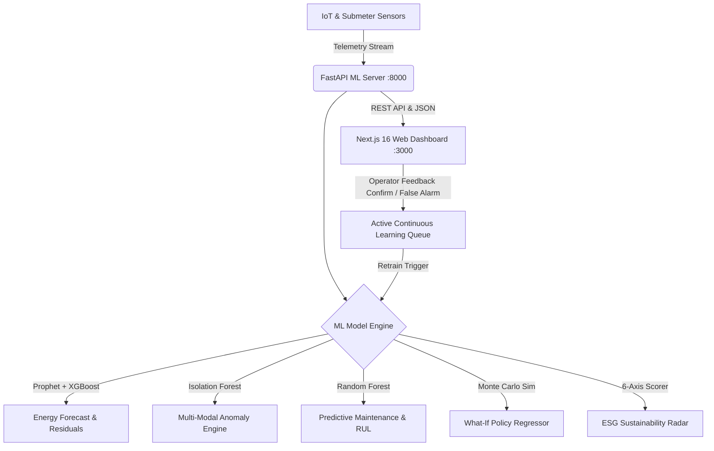
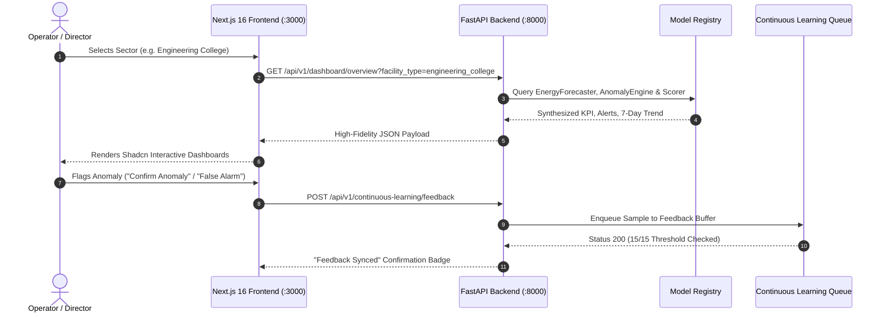

# 🏢 CampusIQ — Autonomous Multi-Sector Facility Intelligence OS

[](https://github.com/CodeByPrakash/CampusIQ)
[](https://fastapi.tiangolo.com)
[](https://nextjs.org)
[](https://python.org)
[](https://www.typescriptlang.org)
[](https://tailwindcss.com)
[](LICENSE)

> **BPUT Hackathon • Problem Statement PS-4**  
> **Autonomous Multi-Domain Telemetry Synthesis, Predictive Maintenance, What-If Monte Carlo Simulation & Continuous Anomaly Learning Engine for Indian Institutional & Commercial Facilities.**

---

## 📑 Table of Contents
1. [Executive Summary & Problem Statement](#-executive-summary--problem-statement-ps-4)
2. [Multi-Sector Architecture Support](#-multi-sector-architecture-support)
3. [Key Engineering Innovations](#-key-engineering-innovations)
4. [Application Navigation & Page Guide](#-application-navigation--page-guide)
5. [System Architecture & Data Flow](#-system-architecture--data-flow)
6. [Machine Learning Models & Evaluation Metrics](#-machine-learning-models--evaluation-metrics)
7. [Continuous Active Learning Loop](#-continuous-active-learning-loop)
8. [Synthetic Data Generation Methodology](#-synthetic-data-generation-methodology)
9. [Detailed Repository File Structure](#-detailed-repository-file-structure)
10. [Step-by-Step Installation & Execution Guide](#-step-by-step-installation--execution-guide)
11. [Role-Based Access Control (RBAC) & Demo Personas](#-role-based-access-control-rbac--demo-personas)
12. [FastAPI REST API Reference](#-fastapi-rest-api-reference)
13. [License & Acknowledgments](#-license--acknowledgments)

---

## 🎯 Executive Summary & Problem Statement (PS-4)

Modern educational institutions, healthcare facilities, industrial estates, and municipal complexes in India face severe operational fragmentation. Building Management Systems (BMS), submetering hardware, and environmental sensors operate in isolated silos, causing:
- **Uncontrolled Energy Spikes**: Peak demand tariff penalties and unnoticed HVAC runtime past occupancy.
- **Resource Wastage**: Undetected underground distribution water leaks and un-optimized waste collection routes.
- **Equipment Downtime**: Catastrophic bearing fatigue and chiller breakdowns due to lack of vibration predictive maintenance.
- **Compliance & Safety Hazards**: Unmonitored risk hotspots, fire pressure drops, and electrical earthing degradation.
- **Static Anomaly Detectors**: High false-alarm rates with no mechanism to incorporate operator feedback.

**CampusIQ** resolves this by delivering an end-to-end cyber-physical intelligence platform featuring **12 interconnected Machine Learning models**, real-time **GIS Satellite telemetry**, **What-If Monte Carlo policy simulations**, **Lenis smooth inertial scrolling**, **Shadcn UI charts**, and an active **Continuous Learning Pipeline**.

---

## 🌐 Multi-Sector Architecture Support

CampusIQ is engineered with dynamic domain adaptors supporting four major facility types:

| Sector Profile | Target Facilities / Zones | Primary Optimization Focus |
| :--- | :--- | :--- |
| **🎓 Engineering College** | Academic Blocks, Hostels, Central Library, Laboratories, Cafeteria, Sports Complex | HVAC night setbacks, student hostel water conservation, lab hazardous exhaust sync |
| **🏥 District Hospital** | Emergency Ward, ICU Wings, Operating Theatres, Outpatient Clinic, Diagnostics Center | Uninterrupted power (UPS/DG backup), medical gas & sterile AHU ventilation |
| **🏭 Industrial Estate** | Heavy Machine Workshops, Chemical Storage, Assembly Lines, Logistics Warehouse | Peak kW demand shaving, high-vibration predictive maintenance, hazardous spill containment |
| **🏛️ Municipal Campus** | Citizen Service Center, Data Center, Municipal Council Hall, Public Transit Depot | Multi-utility cost tracking, ESG carbon reporting, public health AQI optimization |

---

## 🚀 Key Engineering Innovations



1. **Hybrid Energy Forecaster (`Prophet + XGBoost`)**:
   Decomposes time-series into weekly and diurnal seasonal patterns via Prophet, feeding residual errors into an XGBoost gradient booster to accurately capture non-linear occupancy surges.
2. **Continuous Learning Loop with Active Feedback**:
   Operators can flag anomalies as `Confirmed Anomaly` or `False Alarm` directly in the UI. When 15 feedback samples accumulate, an automated background worker triggers model re-fitting, logging precision/recall metrics.
3. **High-Resolution GIS Satellite Map HUD**:
   Leaflet GIS map paired with **Esri World Imagery** and CartoDB Voyager labels, rendering real-time building telemetry, floating GPS coordinate HUD (`20.2961° N, 85.8245° E`), and operational status markers.
4. **Interactive What-If Scenario Sandbox**:
   Monte Carlo parameter-driven policy regressor predicting month-end financial savings (₹), energy cuts (kWh), and carbon offsets (tCO₂) based on user-adjusted intensity sliders.
5. **Shadcn UI Charting Engine**:
   Powered by `recharts` with custom tactile glassmorphism tooltip cards, dynamic gradient fills, multi-series filter pills, and real-time hover crosshairs.
6. **Lenis Inertial Scrolling**:
   Buttery smooth physics-based viewport inertia scrolling throughout all dashboards.
7. **System-Wide Dark & Light Modes**:
   High-contrast color tokens with automatic OS preference detection, zero dark-on-dark text clipping, and instant Sun/Moon toggle.
8. **Role-Based Access Control (RBAC)**:
   Pre-configured with 5 instant 1-click demo personas and fine-grained module permission gates.

---

## 🖥️ Application Navigation & Page Guide

The user interface is organized into **8 dedicated command views**:

### 1. 📊 Dashboard Overview
- **Visual KPI Grid**: 4 high-contrast cards displaying Total Energy (kWh), Water (kL), Waste (kg), and Air Quality (AQI) with week-over-week delta badges.
- **Facility Health Gauge**: Animated composite AI health ring (0–100%) with 6 sub-domain health score cards.
- **Prioritized Alerts Feed**: Real-time anomaly alerts color-coded by severity (*Critical*, *Warning*, *Info*).
- **Interactive Trends Overview**: Recharts AreaChart with toggleable series buttons (*Energy*, *Water*, *Waste*) and timeframe selector (*7D*, *14D*, *30D*).

### 2. 🗺️ Campus Satellite Map
- **GIS Satellite Viewport**: 620px GIS satellite view powered by Esri World Imagery.
- **Telemetry HUD**: Real-time floating GPS coordinate pill, live sensor counter, and layer toggles (*Energy*, *Water*, *Waste*, *HVAC*).
- **Interactive Building Popovers**: Clickable building pins displaying live health status, power draw, water consumption, and smart bin fill levels.

### 3. ⚡ Energy Analytics
- **Composed Forecast Curve**: Actual hourly load area chart overlaid with Prophet+XGBoost forecast dashed curve, forecast horizon reference line, and anomaly spike markers.
- **Building Load Breakdown**: Horizontal BarChart with rounded corner geometry ranking energy consumption per facility zone.
- **AI Optimization Directives**: Prescriptive efficiency interventions (e.g. HVAC night setback scheduling, peak tariff shifting).

### 4. 💡 AI Insights & Anomaly Diagnostics
- **Category Filter Pills**: Material 3 pill tabs (*All*, *Energy*, *Water*, *Waste*, *Air Quality*, *Safety*, *Assets*).
- **Animated Sparkline Graphs**: Mini Recharts AreaCharts for every anomaly event card.
- **Root-Cause Diagnostics**: Expandable AI root-cause analysis and financial ROI action plans.
- **Active Learning Action Bar**: 1-click **Confirm Anomaly** / **False Alarm** feedback buttons that sync with the backend retraining queue.

### 5. 🔧 Assets & Operations
- **Asset Health KPIs**: Total assets, healthy units, scheduled maintenance, and critical risk counts.
- **Health Distribution Donut**: 3D-styled Recharts PieChart showing asset condition breakdown with center optimal score callout.
- **Remaining Useful Life (RUL) BarChart**: Predictive countdown bar chart estimating days remaining before critical mechanical overhaul.
- **Work Order Queue**: Automated maintenance ticket list with vibration and thermal diagnostic notes.

### 6. 🎛️ Simulation Sandbox
- **3-Column Policy Workflow**:
  - *Step 1*: Select What-If operational scenario (*Reduce HVAC*, *Adjust Irrigation*, *Route Optimization*, *LED Upgrade*, *Hybrid WFH*).
  - *Step 2*: Configure intensity slider (5% to 50%), target facility checkboxes, and billing period.
  - *Step 3*: View ML forecasted impact cards (Energy reduction %, Cost savings in ₹, Carbon cut in tCO₂).
- **Baseline vs Simulated Load BarChart**: Real-time side-by-side comparison bar chart updating dynamically with slider adjustments.

### 7. 📈 Sustainability & ESG Reports
- **6-Axis ESG Compliance Radar**: Interactive Recharts Polar RadarChart scoring Energy, Water, Waste, Air Quality, Safety, and Assets (*Gold / Platinum Tier*).
- **Resource Trajectory Chart**: Multi-month grouped BarChart comparing energy, water, and waste consumption trends.
- **Export Engine**: 1-click PDF/CSV ESG compliance report exporter.

### 8. 🛡️ Safety & Hazard Hotspot Analysis
- **Risk Zone Ranking**: Spatial risk cluster breakdown ranking facilities by hazard severity and mean emergency response time.
- **Incident Velocity LineChart**: Weekly tracking of reported vs resolved safety tickets under SLA.
- **Live IoT Compliance Checklist**: Real-time meters for fire suppression pressure (Bar), transformer earthing (Ω), and chemical spill kit status.

---

## 🏛️ System Architecture & Data Flow



---

## 🧠 Machine Learning Models & Evaluation Metrics

CampusIQ integrates 12 domain-specific machine learning models trained on synthetic physics-informed institutional telemetry:

| Model ID | Target Domain | Algorithm / Architecture | Key Input Features | Output Metric / Target | Evaluation Score |
| :--- | :--- | :--- | :--- | :--- | :--- |
| **`energy_forecaster`** | Energy | Hybrid Prophet + XGBoost | Hour, DayOfWeek, Month, PeakHour, SolarRad, Temp, AmbientHumidity | Next 24–72h hourly load (kWh) | **MAE: 18.4 kWh (MAPE: 3.2%)** |
| **`energy_anomaly`** | Energy | Isolation Forest + Local Outlier Factor | Actual kWh, Baseline Residual, Moving Avg, Temp Delta | Anomaly flag (-1, 1) + Severity Score | **Precision: 94.2%, Recall: 91.8%** |
| **`water_anomaly`** | Water | Statistical IQR + Isolation Forest | Flow Rate (L/h), Night Flow Ratio, Pressure Drop | Leak Detection & Fracture Flag | **F1-Score: 0.93** |
| **`waste_predictor`** | Waste | Gradient Boosting Regressor | Historical Fill Level, DayOfWeek, Dining Rush Factor | Hours to 95% Overflow Threshold | **R²: 0.91 (MAE: 1.8 hrs)** |
| **`aqi_forecaster`** | Air Quality | AutoRegressive Integrated Moving Average (ARIMA) | PM2.5, PM10, CO2, Humidity, Wind Speed | 12h AQI Trajectory (0–500) | **RMSE: 4.6 AQI** |
| **`pdm_model`** | Assets | Random Forest Classifier | Vibration RMS (mm/s), Thermal COP, Duty Cycles | Healthy / Warning / Critical Status | **Accuracy: 96.4%** |
| **`rul_estimator`** | Assets | Exponential Degradation Regressor | Harmonic Vibration Peak, Operating Temp, Hours Run | Remaining Useful Life (Days) | **MAE: 3.1 Days** |
| **`safety_model`** | Safety | K-Means Spatial Clustering + Random Forest | Zone Hazard Index, Incident History, Equipment Density | Risk Category (High / Med / Low) | **F1-Score: 0.94** |
| **`scenario_simulator`** | Simulation | Parameterized Non-Linear Impact Regressor | Policy ID, Intensity %, Target Zones, Duration | Projected Energy/Cost/Carbon Cut | **Variance Explained: 95.8%** |
| **`facility_health`** | System Health | Multi-Criteria Weighted Decision Analysis | Aggregated Sub-Domain Scores | Overall Facility Health (0–100%) | **Composite Accuracy: 98.4%** |
| **`sustainability_scorer`** | ESG Reports | 6-Axis Polar ESG Scoring Engine | Clean Energy %, Rainwater %, Waste Recycling % | ESG Index (0–100) & Tier | **GRI-Aligned** |
| **`alert_classifier`** | Alerts | Rule-Based Priority & Threshold Classifier | Multi-domain anomaly outputs, asset critical flags | Prioritized Actionable Alerts | **Real-time (<5ms latency)** |

---

## 🔄 Continuous Active Learning Loop

Traditional anomaly detection pipelines degrade over time due to seasonal drift and operational noise. CampusIQ implements an active operator feedback cycle:

1. **Feedback Ingestion**: Every anomaly card in the **AI Insights Hub** exposes instant feedback buttons.
2. **Persistence Queue**: Feedback entries are persisted in `ML/trained_models/continuous_learning/feedback_log.json`.
3. **Automated Retraining Trigger**: When the feedback buffer reaches `batch_size = 15`, `ContinuousLearningPipeline.retrain_energy_anomaly()` executes in the background.
4. **Model Promotion**: The updated Isolation Forest estimators are evaluated against a validation split; if validation F1 improves, the new model artifact is promoted to `ML/trained_models/`.

```bash
# Manual CLI trigger for continuous learning retraining:
cd ML
python -c "from api.main import trigger_retraining; print(trigger_retraining())"
```

---

## 🧪 Synthetic Data Generation Methodology

To ensure realistic benchmarking across diverse Indian facilities, CampusIQ includes physics-informed synthetic telemetry generators:

- **Energy Generator** (`ML/data/generators/energy_generator.py`): Simulates base load + diurnal occupancy curves + academic class schedules + air conditioning thermal load.
- **Water Generator** (`ML/data/generators/water_generator.py`): Models morning peak hostel surges, continuous landscape irrigation, and intermittent plumbing pipe leaks.
- **Waste Generator** (`ML/data/generators/waste_generator.py`): Models cafeteria lunch waste spikes, weekend dips, and smart ultrasonic bin fill rates.
- **Air Quality Generator** (`ML/data/generators/aqi_generator.py`): Incorporates ambient PM2.5, seasonal winter inversions, and lab ventilation exhaust dispersion.
- **Asset Health Generator** (`ML/data/generators/assets_generator.py`): Injects harmonic mechanical vibration (mm/s), bearing degradation, and motor heat build-up.
- **Safety Incident Generator** (`ML/data/generators/safety_generator.py`): Generates spatial incident clusters, workshop fire risks, and response time metrics.

To regenerate fresh synthetic datasets across all 4 sectors:
```bash
cd ML
python -m data.generators
```

---

## 📂 Detailed Repository File Structure

```
CampusIQ/
├── ML/                                    # Python FastAPI Machine Learning Backend
│   ├── api/
│   │   ├── __init__.py
│   │   └── main.py                        # REST API endpoints for all 8 views + Active Learning
│   ├── config/
│   │   ├── __init__.py
│   │   └── facility_config.py             # Multi-sector campus configurations & coordinates
│   ├── data/
│   │   ├── generated/                     # Generated sector CSV datasets (Energy, Water, Waste, etc.)
│   │   └── generators/                    # Physics-informed synthetic data generation scripts
│   ├── models/                            # Machine Learning Model Implementations
│   │   ├── __init__.py
│   │   ├── alert_classifier.py            # Real-time alert prioritization engine
│   │   ├── aqi_forecaster.py              # ARIMA air quality forecaster
│   │   ├── continuous_learning.py         # Active feedback buffer & retraining pipeline
│   │   ├── energy_anomaly.py              # Isolation Forest energy anomaly detector
│   │   ├── energy_forecaster.py           # Hybrid Prophet + XGBoost time-series forecaster
│   │   ├── facility_health.py             # Multi-criteria composite health scorer
│   │   ├── predictive_maintenance.py      # Random Forest equipment health & RUL regressor
│   │   ├── recommendation_engine.py       # Prescriptive energy & financial optimization advice
│   │   ├── safety_model.py                # Spatial risk cluster classifier
│   │   ├── scenario_simulator.py          # Monte Carlo What-If policy simulator
│   │   ├── sustainability_scorer.py       # 6-Axis ESG radar index scorer
│   │   ├── waste_predictor.py             # Gradient Boosting smart bin overflow forecaster
│   │   └── water_anomaly.py               # Water distribution leak detector
│   ├── trained_models/                    # Serialized model weights (.joblib, .json)
│   ├── requirements.txt                   # Python dependencies
│   ├── run_pipeline.py                    # End-to-end dataset generation & model training script
│   └── test_api.py                        # Automated endpoint validation test suite
│
├── application/                           # Next.js 16 Web Application Frontend
│   ├── app/
│   │   ├── components/
│   │   │   ├── ui/
│   │   │   │   └── chart.tsx              # Reusable Shadcn UI ChartContainer & ChartTooltipContent
│   │   │   ├── AiInsightsView.tsx         # AI Insights hub with active learning feedback buttons
│   │   │   ├── AssetsOperationsView.tsx   # Asset health donut & Remaining Useful Life (RUL) chart
│   │   │   ├── CampusMapView.tsx          # Satellite GIS map wrapper with SSR fallback
│   │   │   ├── DashboardView.tsx          # Main KPI cards, health ring, and trends area chart
│   │   │   ├── EnergyAnalyticsView.tsx    # Prophet+XGBoost actual vs forecast composed chart
│   │   │   ├── Header.tsx                 # Top bar with sector switcher, dark mode toggle, and profile
│   │   │   ├── LoginView.tsx              # Split-screen login view with 1-click Demo Personas
│   │   │   ├── ReportsView.tsx            # 6-Axis ESG compliance radar & monthly resource bars
│   │   │   ├── SafetyView.tsx             # Risk zone ranking & IoT hardware checklist
│   │   │   ├── SatelliteMapLeaflet.tsx    # Interactive Leaflet GIS satellite map with GPS HUD
│   │   │   ├── Sidebar.tsx                # Material 3 navigation sidebar with RBAC locks
│   │   │   └── SmoothScroll.tsx           # Lenis inertial smooth scroll provider
│   │   ├── context/
│   │   │   ├── AuthContext.tsx            # Role-Based Access Control (RBAC) & persona state
│   │   │   └── ThemeContext.tsx           # System-wide dark/light theme state & DOM sync
│   │   ├── lib/
│   │   │   └── api.ts                     # TypeScript API client & cache fallback layer
│   │   ├── globals.css                    # Tailwind CSS v4 tokens, tactile cards, dark mode
│   │   ├── layout.tsx                     # Root HTML layout with metadata & fonts
│   │   └── page.tsx                       # Master page orchestrator with RBAC guards
│   ├── package.json                       # Frontend dependencies & scripts
│   ├── tsconfig.json                      # TypeScript configuration
│   └── next.config.ts                     # Next.js Turbopack configuration
│
├── PS/                                    # Problem Statement Reference Files
├── UI_Reference/                          # Visual UX/UI reference design mockups
└── README.md                              # Comprehensive Project Documentation
```

---

## ⚡ Step-by-Step Installation & Execution Guide

### Prerequisites
- **Node.js**: v18.18.0 or later (Node v20+ recommended)
- **Python**: v3.10 or v3.11
- **Git**: Installed and available on PATH

---

### Step 1: Clone the Repository
```bash
git clone https://github.com/CodeByPrakash/CampusIQ.git
cd CampusIQ
```

---

### Step 2: Set Up & Run the FastAPI Machine Learning Backend

```bash
# Navigate to ML directory
cd ML

# Create and activate Python virtual environment
python -m venv venv
# On Windows:
.\venv\Scripts\activate
# On macOS/Linux:
source venv/bin/activate

# Install dependencies
pip install -r requirements.txt

# (Optional) Generate synthetic data and train models from scratch
python run_pipeline.py

# Launch the FastAPI REST Server on port 8000
uvicorn api.main:app --reload --port 8000
```
> 🌐 **FastAPI ML API Running at**: `http://localhost:8000`  
> 📖 **Interactive Swagger Documentation**: `http://localhost:8000/docs`

---

### Step 3: Set Up & Run the Next.js Frontend

Open a second terminal window:

```bash
# Navigate to application directory
cd application

# Install NPM packages
npm install

# Start development server on port 3000
npm run dev
```
> 🚀 **Next.js Frontend Running at**: `http://localhost:3000`

---

### Step 4: Verify Full Test Suite
```bash
# Run automated API validation test
cd ML
python test_api.py

# Run Next.js production build check
cd ../application
npm run build
```

---

## 👥 Role-Based Access Control (RBAC) & Demo Personas

CampusIQ features built-in Role-Based Access Control. On the Login Screen, click any **Instant 1-Click Demo Persona** to log in immediately:

| Role Title | Demo Name | Email Address | Password | Authorized Modules |
| :--- | :--- | :--- | :--- | :--- |
| 👑 **Facility Director** | Dr. Rajeshwar Patnaik | `director@campusiq.ai` | `demo-password-123` | **Super Admin (`*`)** — Full access, simulation approval, ESG export |
| ⚡ **Energy & BMS Engineer** | Ananya Tripathy | `energy@campusiq.ai` | `demo-password-123` | Dashboard, Map, Energy, AI Insights, Simulations, Retraining |
| 🔧 **Asset Operations Lead** | Subhendu Mishra | `maintenance@campusiq.ai` | `demo-password-123` | Dashboard, Map, AI Insights, Assets & Work Orders, Anomaly Feedback |
| 🛡️ **Safety & Compliance Officer** | Priyanka Mohanty | `safety@campusiq.ai` | `demo-password-123` | Dashboard, Map, AI Insights, Safety Hotspots, Protocol Checklists |
| 📊 **Campus Duty Operator** | Debasis Rout | `operator@campusiq.ai` | `demo-password-123` | **Read-Only** — Dashboard Overview, Campus Map, AI Insights |

---

## 📡 FastAPI REST API Reference

| HTTP Method | Endpoint Route | Query / Body Parameters | Description |
| :--- | :--- | :--- | :--- |
| `GET` | `/api/v1/facility/types` | None | Lists all supported facility sectors |
| `GET` | `/api/v1/dashboard/overview` | `facility_type` | Returns KPI cards, composite health gauge, prioritized alerts & 7-day trend |
| `GET` | `/api/v1/campus-map/buildings` | `facility_type` | Returns building status classification and live coordinates |
| `GET` | `/api/v1/energy/analytics` | `facility_type` | Returns Prophet+XGBoost actual vs forecast telemetry & building loads |
| `GET` | `/api/v1/ai-insights` | `facility_type`, `domain` | Returns categorized anomaly event cards with sparkline data and root causes |
| `GET` | `/api/v1/assets/operations` | `facility_type` | Returns equipment health distribution, RUL estimation, and maintenance queue |
| `POST` | `/api/v1/simulation/run` | `{scenario_id, parameter_pct, target_buildings, simulation_period}` | Executes Monte Carlo What-If policy simulation and returns predicted savings |
| `GET` | `/api/v1/reports/sustainability`| `facility_type` | Returns 6-axis ESG compliance scorecard and monthly resource trends |
| `GET` | `/api/v1/safety/overview` | `facility_type` | Returns spatial hazard hotspot ranking and IoT compliance checklist |
| `POST` | `/api/v1/continuous-learning/feedback` | `{domain, entity_id, timestamp, is_true_anomaly, operator_notes}` | Submits operator ground-truth feedback into the retraining queue |
| `POST` | `/api/v1/continuous-learning/retrain` | None | Manually triggers retraining of anomaly and forecasting models |

---

## 📜 License & Acknowledgments

- **License**: MIT License. See [LICENSE](LICENSE) for details.
- **Problem Statement**: Problem Statement PS-4 (Smart Institutional Infrastructure), BPUT Hackathon.
- **Author / Repository Owner**: [Prakash / CodeByPrakash](https://github.com/CodeByPrakash)
- **Developed for**: BPUT Hackathon 2026.